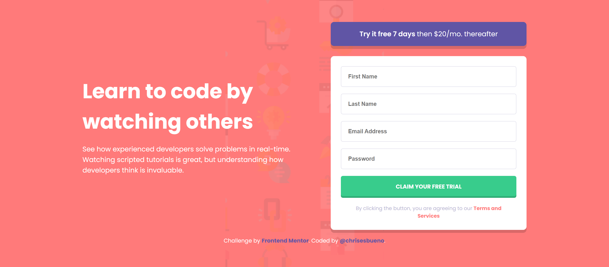
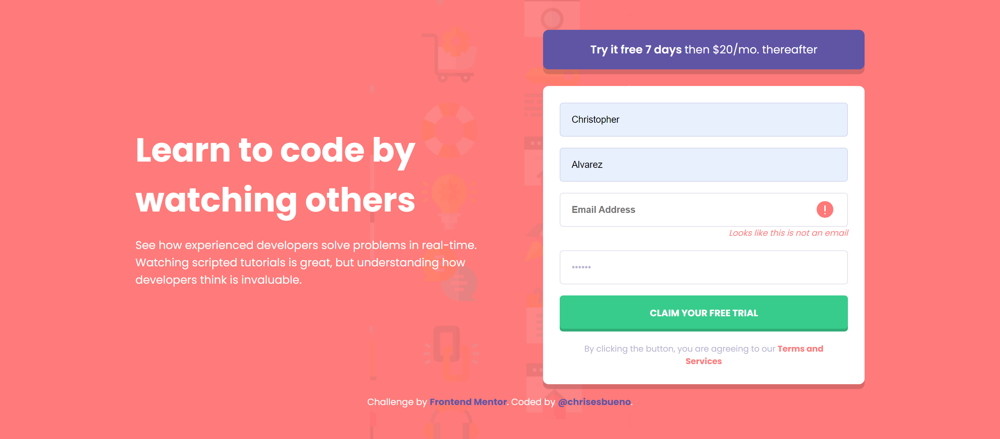
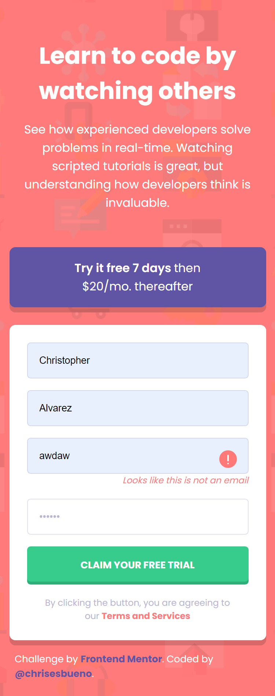

# Frontend Mentor - Intro component with sign up form solution

This is a solution to the [Intro component with sign up form challenge on Frontend Mentor](https://www.frontendmentor.io/challenges/intro-component-with-signup-form-5cf91bd49edda32581d28fd1). Frontend Mentor challenges help you improve your coding skills by building realistic projects. 

## Table of contents

- [Overview](#overview)
  - [The challenge](#the-challenge)
  - [Screenshot](#screenshot)
  - [Links](#links)
- [My process](#my-process)
  - [Built with](#built-with)
  - [What I learned](#what-i-learned)
- [Author](#author)

## Overview

### The challenge

Users should be able to:

- View the optimal layout for the site depending on their device's screen size
- See hover states for all interactive elements on the page
- Receive an error message when the `form` is submitted if:
  - Any `input` field is empty. The message for this error should say *"[Field Name] cannot be empty"*
  - The email address is not formatted correctly (i.e. a correct email address should have this structure: `name@host.tld`). The message for this error should say *"Looks like this is not an email"*

### Screenshot








### Links

- Solution URL: [Add solution URL here](https://www.frontendmentor.io/solutions/intro-component-with-signup-form-ehoEAtGtuz)
- Live Site URL: [Add live site URL here](https://chrisesbueno.github.io/signup-form/)

## My process

### Built with

- Semantic HTML5 markup
- CSS custom properties
- Flexbox
- CSS Grid
- Mobile-first workflow

### What I learned

```js
button.addEventListener('click', (e) => {
    e.preventDefault()
    let total = 4
    inputs.forEach(element => {
        if (element.children[0].value == '') {
            element.classList.add('active');
        } else  {
            element.classList.remove('active');
            total--;
        }
        console.log(total)
    });
    if (email.children[0].value.match(verified)) {
        email.classList.remove('active');
        total--;
        if (total == 0) {
            alert('Succesfuly!');
            inputs.forEach(element => {
                element.children[0].value = '';
            });
            email.children[0].value = '';
        }
    } else {
        email.classList.add('active');
    }
})
```

## Author

- Frontend Mentor - [@chrisesbueno](https://www.frontendmentor.io/profile/chrisesbueno)
- Twitter - [@chrisesbueno](https://www.twitter.com/chrisesbueno)


